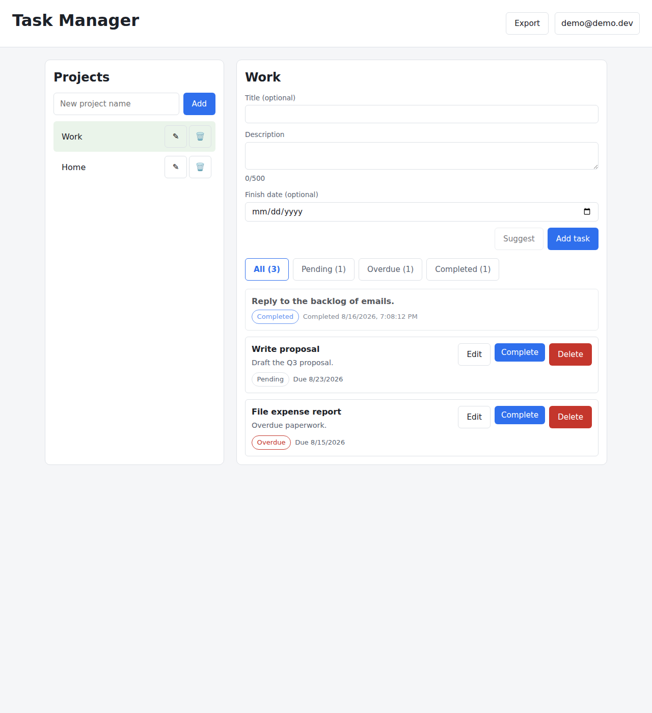

# Task Manager — the simple cut



- **Multi-user task manager** with hand-rolled auth (scrypt + HMAC JWT on `node:crypto`, no auth library), strict per-account isolation (foreign data answers 404, indistinguishable from nonexistent), and a terminal lock on completed tasks.
- **Deliberately small**: one package, SQLite only, Vue UI, two documents. Built as the answer to a 100-finding review of a fuller sibling project — [FIXES.md](FIXES.md) maps every finding to what this codebase does about it.
- **63 tests, one command, no services**: `npm test`.

```bash
npm install
npm run seed     # demo account: demo@demo.dev / demo1234, tasks in every state
npm run build && npm start
# → http://localhost:3200
```

## Running it

Requires Node 22+.

| Command | What it does |
|---|---|
| `npm run build && npm start` | Build the frontend, serve app + API as one process on :3200 (one origin, no CORS) |
| `npm run dev` | API (:3200, auto-restart) and Vite dev server (:5180, hot reload) together; Ctrl-C stops both |
| `npm test` | 63 tests: auth unit, API integration, isolation, account lifecycle, rate limit |
| `npm run seed` | Idempotent demo data: pending, due, overdue, completed on time, completed late |
| `docker build -t tasks . && docker run -p 3200:3200 -v tasks:/data -e JWT_SECRET=change-me tasks` | Containerized production run |

Configuration is optional env vars, documented in one place: [.env.example](.env.example).
CI ([.github/workflows/ci.yml](.github/workflows/ci.yml)) runs install, tests and build on every push.

## What it does

| Feature | Enforced in | Proven by |
|---|---|---|
| Register, log in, log out; passwords stored as self-describing scrypt records | `server/auth.js` | `test/auth-unit.test.js` (incl. a truncated-hash regression) |
| Sessions as HS256 JWTs; the token never chooses its own verification | `server/auth.js` | alg:none, alg-swap, tamper, expiry tests |
| A user sees only their own data; foreign = 404, byte-identical with imaginary | ownership in every SQL `WHERE` (`server/db.js`) | `test/isolation.test.js` — two accounts, hostile ids |
| Projects & tasks CRUD; completion is an explicit, irreversible command | `server/routes.js` → `server/db.js` | `test/api.test.js` |
| Completed tasks locked (409); a completed task shields its project from deletion | `server/db.js` | lock triad + permanent-shield tests |
| Overdue / delivered-late derived from **local** calendar days, never stored | `shared/status.js` | its comment names the UTC-vs-local bug this design prevents |
| Account lifecycle: change password (current required), delete account (cascades, kills live tokens), export your data as JSON | `server/routes.js` | `test/account.test.js` |
| Shared zod validation: same schemas in the browser (instant feedback) and the server (authority) | `shared/schemas.js` | strict-schema tests: unknown fields like `ownerId` are rejected |
| Description assistant (Suggest) — a non-binding draft with Undo, from a built-in sample assistant | `server/routes.js` (inline, ~20 lines) | it needs no key, no network, and cannot fail at random |
| Auth abuse brake: 10 attempts/min/IP, 429 + Retry-After | `server/rate-limit.js` | fake-clock window tests |

## API

One error shape everywhere: `{ "error": { "code", "message" } }`.

| Method & path | Purpose |
|---|---|
| `GET /health` | liveness + version (nothing else) |
| `POST /auth/register` · `POST /auth/login` | 201 account · `{ token, user }` (one message for every failed login) |
| `GET/POST /api/projects` · `PUT/DELETE /api/projects/:id` | projects CRUD (delete: 409 if shielded) |
| `GET/POST /api/projects/:id/tasks` | a project's tasks |
| `GET/PUT/DELETE /api/tasks/:id` · `POST /api/tasks/:id/complete` | task ops — 409 once completed |
| `POST /api/account/password` · `DELETE /api/account` | change password · erase account and data |
| `GET /api/export` | your own data, as downloadable JSON |
| `POST /api/ai/suggest` | expand a title/rough note into a description draft |

Everything under `/api` requires `Authorization: Bearer <token>` — the gate is mounted once on the prefix, so new routes are private by default, and it re-checks the account still exists (a deleted account's token dies immediately).

## Decisions (and what was rejected)

1. **SQLite only, from hour one** — a second store and a storage seam were rejected: the brief asks for persistence, not for proof of swappability. No migrations exist because the schema was born final.
2. **Auth on `node:crypto`, nothing invented** — scrypt + `timingSafeEqual` + HMAC are the platform's; what's hand-written is the record format (which carries its own cost parameters and `keylen`, so truncation is malformed rather than verifiable) and the JWT verification rules.
3. **Vue for the UI** — the brief forbids auth libraries, not UI libraries. Manual DOM was rejected: it's where the fuller sibling accumulated its focus-loss and `prompt()` problems.
4. **Ownership lives in the SQL `WHERE` clause** — not in route discipline. A route that forgot to check could still not cross accounts; an absent owner binds as `NULL` and matches nothing (fail-closed).
5. **404, never 403, for foreign resources** — a 403 confirms the thing exists, which is the fact being protected. Malformed ids answer identically.
6. **Strict schemas shared by both sides** — unknown fields are rejected, so `ownerId`/`completed` cannot be smuggled in; the browser validates with the same file for instant feedback, and the server remains the authority.
7. **The assistant is a built-in sample** — the brief allows a mocked provider. Rejected: a provider seam and a real-API mode; they doubled the surface in the sibling for an optional feature. The UI names it honestly ("sample assistant") and the draft is the user's to edit or undo.
8. **One rate limit, on `/auth` only** — a fixed window in ~25 lines. The elaborate multi-budget sliding-window limiter was rejected as machinery the problem didn't order. `TRUST_PROXY=true` makes it proxy-aware.
9. **Two documents** — this README and FIXES.md. ADR files, handoff docs, boards and changelogs were rejected: in the sibling project they drifted from the code within days, and a stale doc is worse than none.
10. **Sparse comments** — a comment here states a non-obvious constraint or it doesn't exist.

## Known limitations (deliberate, not oversights)

- **The token lives in localStorage** — an XSS bug would expose sessions. The production fix is an httpOnly cookie plus CSRF handling; kept out of scope, same trade as the sibling project, stated rather than hidden.
- **No revocation and no password reset** — logout discards the token client-side (it stays valid until expiry, max 24h); a *forgotten* password has no recovery path. Password *change* and account *deletion* do exist — and deletion kills outstanding tokens at once.
- **Login timing differs for unknown emails** (no decoy hash) and there's **no per-account lockout** — the per-IP limit is the only brute-force brake. Both were consciously traded away for size.
- **scrypt cost is N=2¹⁵** (below OWASP's 2¹⁷ floor) so the demo stays responsive on unknown hardware; it's one constant, and each stored record carries its own parameters so raising it strands nobody.
- **No email verification or per-user quotas**; registration is limited only by the IP budget.
- **Vue components have no automated tests** — the logic they lean on (status, schemas) is unit-tested in `shared/`; the components were verified in a real browser.
- English-only UI; plain console logs; no request correlation ids. Each becomes worth its cost at a scale this deliberately isn't.
